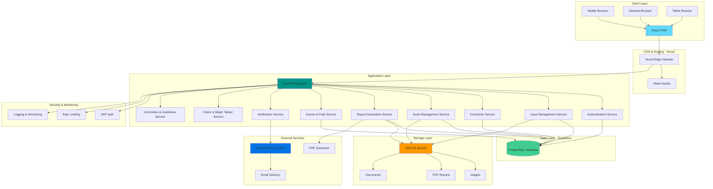
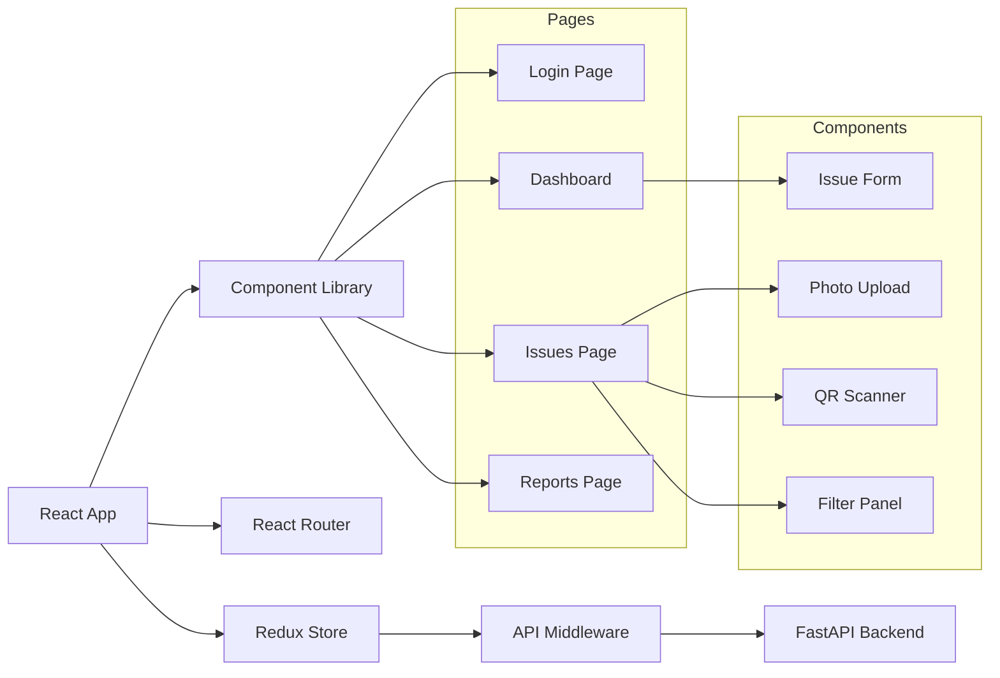
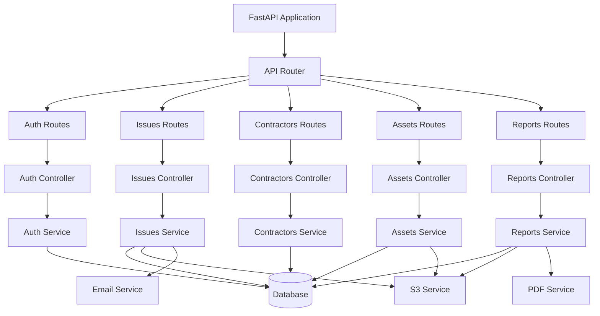
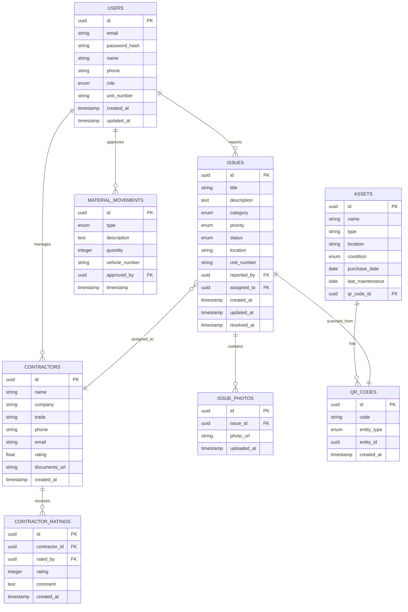
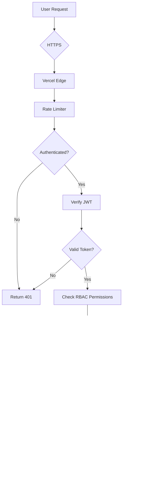
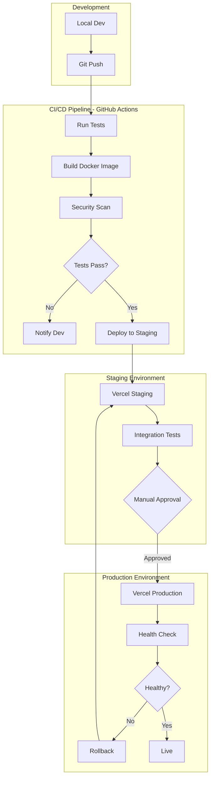
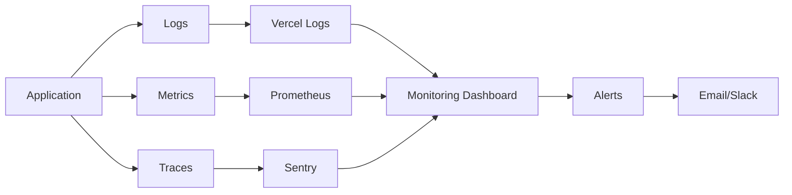

# CommunityOS.ai - System Architecture

## High-Level Architecture Diagram



---

## Detailed Architecture Components

### 1. Frontend Architecture (React)



**Frontend Structure:**
```
frontend/
├── public/
│   ├── index.html
│   └── manifest.json (PWA)
├── src/
│   ├── api/
│   │   ├── client.js
│   │   ├── issues.js
│   │   ├── auth.js
│   │   └── contractors.js
│   ├── components/
│   │   ├── common/
│   │   │   ├── Header.jsx
│   │   │   ├── Sidebar.jsx
│   │   │   ├── Button.jsx
│   │   │   └── Card.jsx
│   │   ├── issues/
│   │   │   ├── IssueForm.jsx
│   │   │   ├── IssueCard.jsx
│   │   │   └── IssueList.jsx
│   │   ├── qrcode/
│   │   │   ├── QRScanner.jsx
│   │   │   └── QRGenerator.jsx
│   │   └── upload/
│   │       └── PhotoUpload.jsx
│   ├── pages/
│   │   ├── Login.jsx
│   │   ├── Dashboard.jsx
│   │   ├── Issues.jsx
│   │   ├── Reports.jsx
│   │   └── Profile.jsx
│   ├── store/
│   │   ├── index.js
│   │   ├── authSlice.js
│   │   ├── issuesSlice.js
│   │   └── contractorsSlice.js
│   ├── utils/
│   │   ├── constants.js
│   │   ├── validators.js
│   │   └── formatters.js
│   ├── App.jsx
│   └── main.jsx
├── package.json
└── vite.config.js
```

---

### 2. Backend Architecture (FastAPI)



**Backend Structure:**
```
backend/
├── app/
│   ├── api/
│   │   ├── v1/
│   │   │   ├── endpoints/
│   │   │   │   ├── auth.py
│   │   │   │   ├── issues.py
│   │   │   │   ├── contractors.py
│   │   │   │   ├── assets.py
│   │   │   │   ├── reports.py
│   │   │   │   └── qrcodes.py
│   │   │   └── api.py
│   │   └── deps.py
│   ├── core/
│   │   ├── config.py
│   │   ├── security.py
│   │   └── logging.py
│   ├── models/
│   │   ├── user.py
│   │   ├── issue.py
│   │   ├── contractor.py
│   │   ├── asset.py
│   │   └── qrcode.py
│   ├── schemas/
│   │   ├── user.py
│   │   ├── issue.py
│   │   ├── contractor.py
│   │   └── response.py
│   ├── services/
│   │   ├── auth_service.py
│   │   ├── issue_service.py
│   │   ├── contractor_service.py
│   │   ├── asset_service.py
│   │   ├── s3_service.py
│   │   ├── email_service.py
│   │   ├── pdf_service.py
│   │   └── qrcode_service.py
│   ├── db/
│   │   ├── base.py
│   │   ├── session.py
│   │   └── init_db.py
│   └── main.py
├── alembic/
│   ├── versions/
│   └── env.py
├── tests/
│   ├── api/
│   ├── services/
│   └── conftest.py
├── requirements.txt
└── alembic.ini
```

---

### 3. Database Schema (PostgreSQL)



---

### 4. API Architecture

**RESTful API Design:**

```
Base URL: https://api.riverdaleconnect.com/api/v1

Authentication: JWT Bearer Token
Header: Authorization: Bearer <token>
```

**Endpoint Groups:**

1. **Authentication** (`/auth`)
   - POST `/auth/register` - User registration
   - POST `/auth/login` - User login
   - POST `/auth/refresh` - Refresh token
   - GET `/auth/me` - Get current user
   - POST `/auth/logout` - Logout

2. **Issues** (`/issues`)
   - POST `/issues` - Create issue
   - GET `/issues` - List issues (paginated, filtered)
   - GET `/issues/{id}` - Get issue details
   - PUT `/issues/{id}` - Update issue
   - DELETE `/issues/{id}` - Delete issue
   - POST `/issues/{id}/photos` - Upload photos
   - PUT `/issues/{id}/assign` - Assign to contractor
   - PUT `/issues/{id}/status` - Update status

3. **Contractors** (`/contractors`)
   - POST `/contractors` - Register contractor
   - GET `/contractors` - List contractors
   - GET `/contractors/{id}` - Get contractor details
   - PUT `/contractors/{id}` - Update contractor
   - POST `/contractors/{id}/ratings` - Add rating

4. **Assets** (`/assets`)
   - POST `/assets` - Register asset
   - GET `/assets` - List assets
   - GET `/assets/{id}` - Get asset details
   - PUT `/assets/{id}` - Update asset
   - POST `/assets/{id}/maintenance` - Log maintenance

5. **Reports** (`/reports`)
   - GET `/reports/weekly` - Generate weekly report
   - GET `/reports/download/{id}` - Download report PDF
   - GET `/reports/analytics` - Get analytics data

6. **QR Codes** (`/qrcodes`)
   - POST `/qrcodes` - Generate QR code
   - GET `/qrcodes/{code}` - Get QR code details
   - GET `/qrcodes/{id}/image` - Get QR code image

---

### 5. Security Architecture



**Security Measures:**

1. **Authentication:**
   - JWT with RS256 algorithm
   - Token expiry: 1 hour
   - Refresh token: 7 days
   - Secure password hashing (bcrypt, cost=12)

2. **Authorization:**
   - Role-based access control (RBAC)
   - Roles: resident, contractor, builder, admin, security, facility
   - Permission matrix per endpoint

3. **Data Security:**
   - All data encrypted in transit (TLS 1.3)
   - Sensitive data encrypted at rest
   - Input validation using Pydantic
   - SQL injection prevention (SQLAlchemy ORM)
   - XSS protection (Content Security Policy)

4. **API Security:**
   - Rate limiting (100 req/min per user)
   - CORS configuration
   - API key rotation
   - Request logging

---

### 6. Deployment Architecture



**Environment Configuration:**

| Environment | Frontend URL | Backend URL | Database |
|-------------|--------------|-------------|----------|
| Development | localhost:5173 | localhost:8000 | Local PostgreSQL |
| Staging | staging.riverdaleconnect.com | api-staging.riverdaleconnect.com | Supabase (staging) |
| Production | app.riverdaleconnect.com | api.riverdaleconnect.com | Supabase (production) |

---

### 7. Scalability & Performance

**Performance Targets:**
- API response time: <200ms (p95)
- Page load time: <2 seconds
- Time to Interactive: <3 seconds
- Lighthouse Score: >90

**Scalability Strategy:**

1. **Backend Scaling:**
   - Horizontal scaling via Vercel serverless functions
   - Connection pooling for database
   - Redis caching for frequent queries
   - Async task processing for reports

2. **Database Scaling:**
   - Read replicas for analytics
   - Indexing strategy on frequently queried fields
   - Partitioning for large tables (issues, photos)

3. **Storage Scaling:**
   - S3 lifecycle policies for archival
   - CloudFront CDN for image delivery
   - Image compression and optimization

4. **Frontend Optimization:**
   - Code splitting and lazy loading
   - Service worker for offline support
   - Image lazy loading
   - Bundle size optimization

---

### 8. Monitoring & Observability



**Monitoring Tools:**
- **Logs**: Vercel Logs, CloudWatch
- **APM**: Sentry for error tracking
- **Uptime**: UptimeRobot
- **Analytics**: Google Analytics / Mixpanel

**Key Metrics:**
- Request rate, error rate, latency (RED method)
- CPU, memory, database connections
- Active users, session duration
- Issue creation rate, resolution time

---

### 9. Disaster Recovery & Backup

**Backup Strategy:**
1. **Database**: Daily automated backups (Supabase)
2. **Files**: S3 versioning enabled
3. **Configuration**: Infrastructure as Code (IaC)
4. **Recovery Time Objective (RTO)**: 4 hours
5. **Recovery Point Objective (RPO)**: 24 hours

**Disaster Recovery Plan:**
1. Automated daily backups to separate region
2. Point-in-time recovery capability
3. Documented restoration procedures
4. Quarterly disaster recovery drills

---

## Technology Justification

### Why React?
- Large ecosystem and community support
- Component reusability
- Excellent PWA support
- Easy mobile migration path

### Why FastAPI?
- High performance (async support)
- Automatic API documentation
- Type safety with Pydantic
- Modern Python features

### Why PostgreSQL/Supabase?
- ACID compliance for critical data
- Rich query capabilities
- Built-in authentication support
- Easy scaling options

### Why AWS S3?
- Cost-effective storage
- High durability (99.999999999%)
- Seamless scaling
- CDN integration

### Why Vercel?
- Optimized for React/Next.js
- Global edge network
- Automatic SSL
- Serverless function support
- Excellent developer experience

---

**Document Version**: 1.0  
**Last Updated**: 2026-07-22  
**Status**: Final
